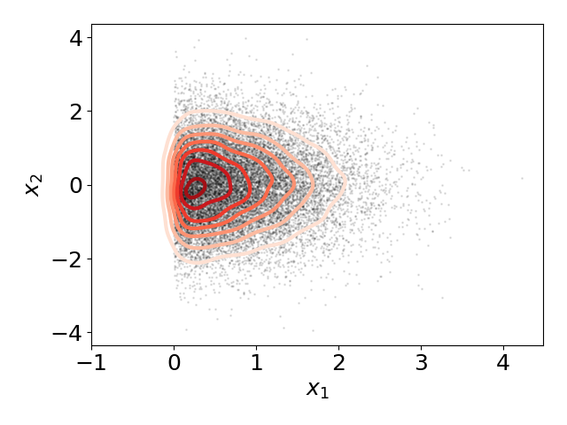

## Hamiltonian Monte Carlo implementation with batched GPU execution and automatic differentiation via PyTorch.

## _Exemplary code for the interview from my torchmcee package_ 

Unlike Pyro which relies on PyTorch multiprocessing utils for
parallelization on a single GPU/TPU device, this simple 
batched implementation of HMC algorithm allows efficient memory usage for without 
overhead from multiprocessing.

For the implementation, see __hamilonian_mc.py__ file. 
Below is a brief illustration of an algorithm in action with 32k chains processed in parallel.

```python
"""
Illustration of an algorithm in action.
"""

import torch
from torch import Tensor

import scipy.stats
import numpy as np
import matplotlib.pyplot as plt

from hamiltonian_mc import run_hmc

plt.rcParams['font.size'] = 18
plt.rcParams['figure.dpi'] = 100


def example_log_prob(samples: Tensor):
    """Unnormalized log prob of truncated multidimensional Gaussian"""
    within_prior_indices = samples[..., 0] >= 0.
    log_probs = torch.empty_like(samples[..., 0]).fill_(- float('inf'))
    log_probs[within_prior_indices] = - 0.5 * (samples[within_prior_indices] ** 2).sum(-1)
    return log_probs


def plot_2d_sampling_res(samples: np.ndarray, x1_grid: np.ndarray, x2_grid: np.ndarray):
    """Plot sampling results for first 2 dimensions."""
    samples = samples[..., :2]
    gkde = scipy.stats.gaussian_kde(samples.T)
    z = np.array(gkde.evaluate([x1_grid.flatten(), x2_grid.flatten()])).reshape(x1_grid.shape)
    plt.contour(x1_grid, x2_grid, z, linewidths=3, cmap=plt.get_cmap('Reds'))
    plt.scatter(samples[..., 0], samples[..., 1], alpha=.1, color='k', s=1)
    plt.xlabel(r'$x_1$')
    plt.ylabel(r'$x_2$')
    plt.tight_layout()
    plt.show()


def main(
    num_chains: int = 2 ** 15, 
    dim: int = 16,
    device: str = 'cuda',
    num_steps: int = 1000, 
    burn_in: int = 100,
    thinning: int = 10,
):
    init_params = torch.rand(num_chains, dim, device=device, dtype=torch.float)
    mcmc_samples = run_hmc(example_log_prob, init_params, num_steps, burn_in, thinning)
    mcmc_samples = mcmc_samples.flatten(0, 1).numpy()
    plot_2d_sampling_res(mcmc_samples, *np.mgrid[-1:3:.05, -3:3:.05])

    
if __name__ == '__main__':
    main()

```


